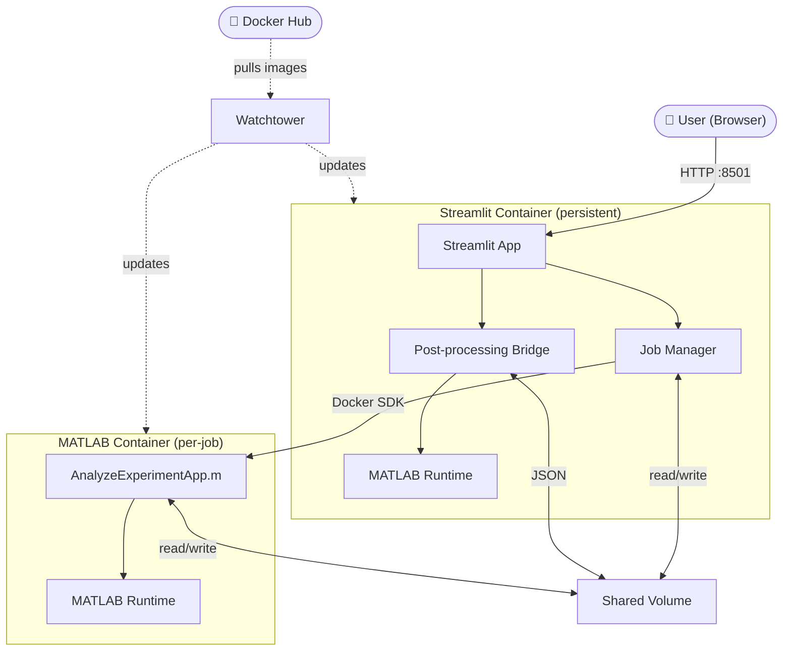

# NSM Web App

It's a web application which serves as an easy to use intefrace to operate the NSM algorithm to analyze epxeriments.

## Architecture
The app consists of two main parts, the web app made with Streamlit and the Matalb algorithm which is present as [Git submodule](https://git-scm.com/book/en/v2/Git-Tools-Submodules) (we have other repo inserted into the project and can pull new commits to it), they are bundled together using [Docker compose](https://docs.docker.com/compose/), using docker also let's us deploy to almost any environemnt, with great ease.

Below is a flow chart which represent how the high level architecture of the app looks like.

