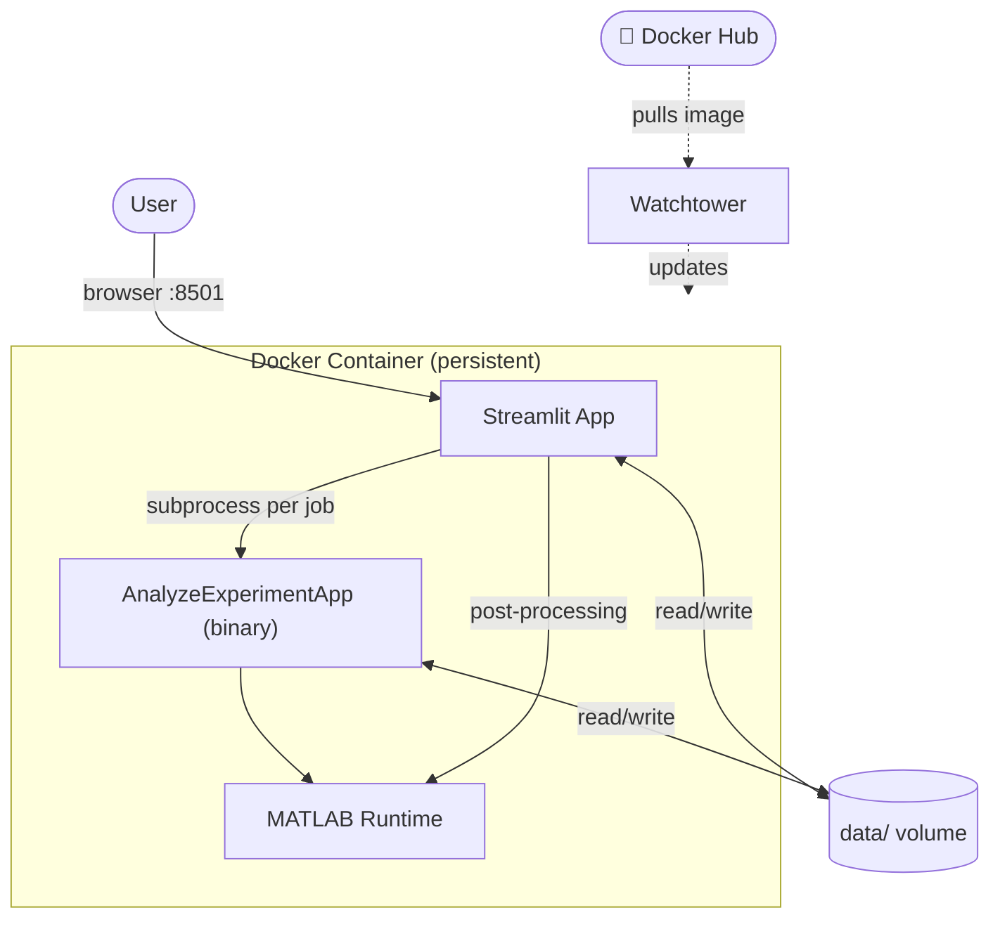

# NSM Web App

A web application providing an easy-to-use interface for running the NSM algorithm to analyze experiments.

## Architecture
The app consists of two main parts: the web UI built with Streamlit, and the MATLAB algorithm present as a [Git submodule](https://git-scm.com/book/en/v2/Git-Tools-Submodules). Both are bundled into a single Docker image, which makes deployment straightforward across environments.

Below is a flow chart showing the high-level architecture.

### Container

- Runs continuously, serves the UI on port 8501.
- Spawns the compiled `AnalyzeExperimentApp` binary as a subprocess for each submitted job.
- Includes the MATLAB Runtime (MCR) — no MATLAB license required at runtime.
- Job data is persisted in the mounted `data/` volume.
