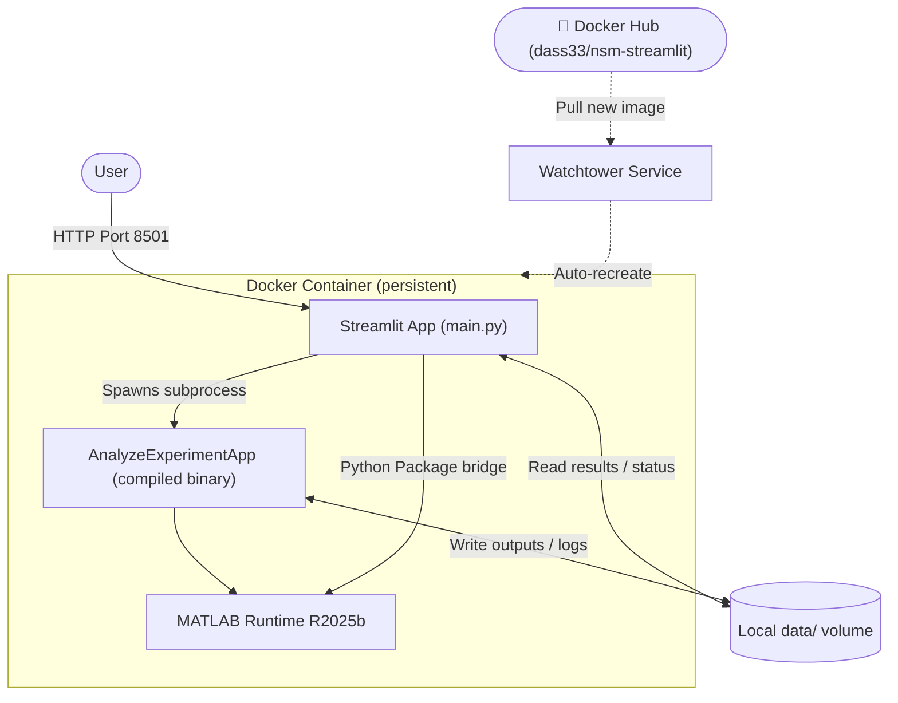

# NSM Web Application Documentation

Welcome to the documentation for the Nanofluidic Scattering Microscopy (NSM) Data Processing Web Application.

This application provides a user-friendly interface for processing raw NSM kymograph data using high-performance MATLAB algorithms, visualising results, calibrating measurement instruments, and running population statistics.

---

## High-Level Architecture & Lifecycle

The application is structured for easy cross-platform deployment and local development. It packages a **Streamlit** user interface and the compiled **MATLAB Runtime (MCR)** into a single, unified Docker container.

### Key Components

*   **Streamlit UI**: Serves as the user frontend. It allows users to upload files, view kymograph previews, override processing settings, run population analyses, and download data as ZIP archives.
*   **MATLAB Subprocess**: When a job is submitted, the Streamlit app spawns the compiled MATLAB executable (`AnalyzeExperimentApp`) as a background subprocess. This binary performs the heavy-duty kymograph detection and analysis.
*   **MATLAB Python Package Bridge (`nsm_algorithms`)**: For interactive post-processing and calibration runs, Streamlit imports a custom MATLAB compiled Python package, invoking algorithms in-memory for instant feedback.
*   **Data Volume Mount**: All files (raw uploads, intermediate variables, logs, and output metadata) are stored in the `data/jobs/<uuid>/` folder on the host machine to ensure persistent storage.
*   **Watchtower Continuous Deployment**: Watchtower monitors the Docker Hub repository and automatically updates the running stack when a new image is pushed.

---

## Navigating the Documentation

*   **[Streamlit Overview](streamlit/index.md)**: Explore the structure and modules of the frontend application.
*   **[MATLAB Bridge & Algorithms](streamlit/matlab_bridge.md)**: Details on the integration between Python and the MATLAB engine.
*   **[Deployment Guide](deployment.md)**: Steps to run the system in local development, on-premise staging, or production VPS.
*   **[Developer & Maintenance Guide](maintenance.md)**: Learn how to set up the developer workspace, recompile MATLAB binaries, and push releases.
*   **[Developer Scripts](scripts.md)**: Quick reference and summaries of the Python helper scripts in the repository.
*   **[Architectural Decision Records (ADR)](reasoning.md)**: Rationale behind technologies chosen for this project (Streamlit, MATLAB runtime integration, Docker).

New to the app? Visiting it with `?tutorial=on` added to the URL shows a step-by-step banner
with a **Run demo dataset** button, so you can see the full workflow without uploading your own files first.
